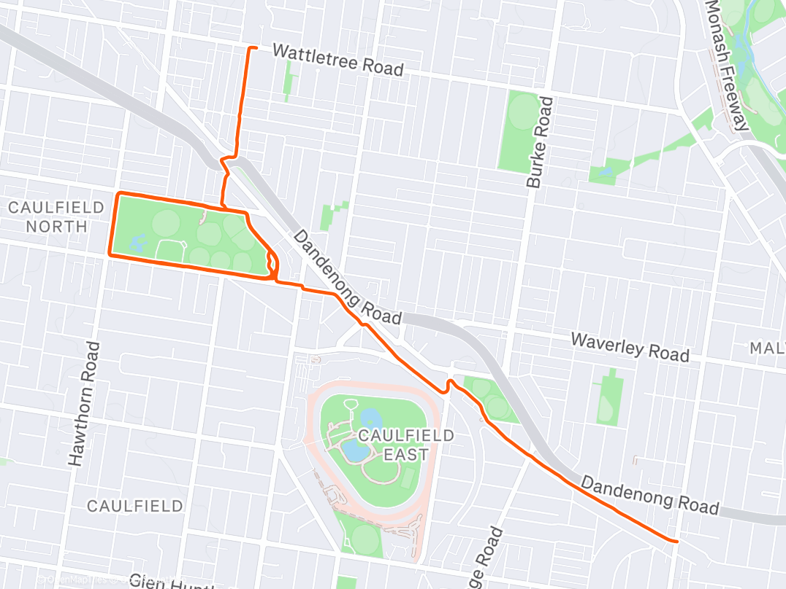

Training for the 2026 Gold Coast Marathon is well underway as more and more of
my Saturday's are being consumed by long runs.

The challenge now is to find a way of making each long run "fun". This week I
decided to do 15 laps of Caulfield Park, with each lap being approximately 2.2km
it was going to be a mind numbing experience. There is some comfort in a
repetitive course as it allows you to enter a meditative trance as you try and
remember what lap you're on.

The fun parts of this run were the pullups I did every lap which is why lats now
hurt more than my legs.
