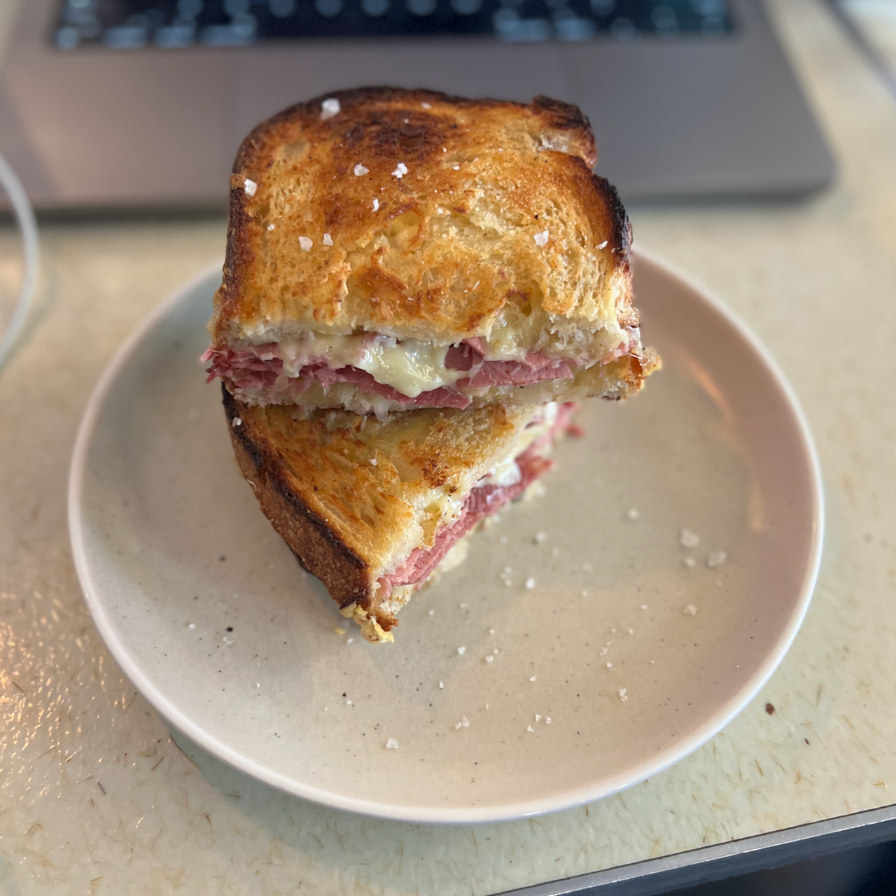

One thing I've found that helps after a long run is to do a fast (<4:00min/km)
speed session the following to squeeze all the lactic acid out of your legs.

At least that's what I wanted to believe on the treadmill this morning.

After that my recovery continued on with an excursion to South Yarra's
[Pound Cafe](https://instagram.com/poundmelbourne) - I have and always will have
a weakness for a Ruben.

