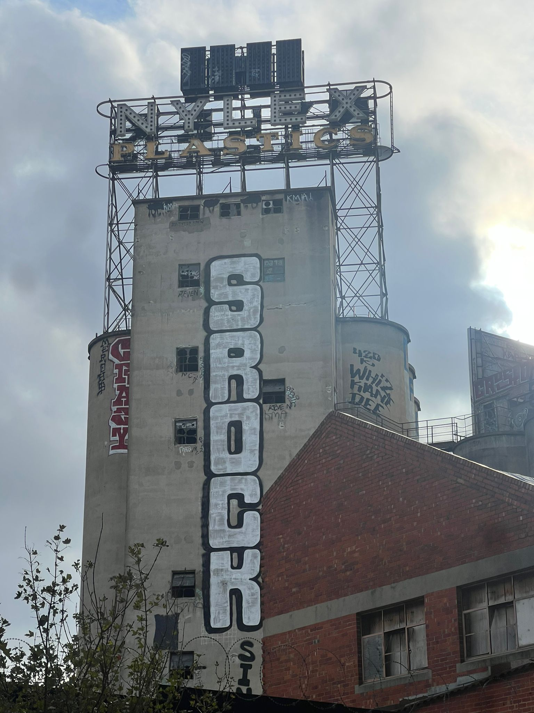

One of the great things about my one-on-ones at work is the ability to go for a wander around Cremorne in the day.  

The modest suburb is often overshadowed by Richmond but it has a number of iconic landmarks such as the Nylex Clock. This tower is such a dog whistle for anyone who has lived in Melbourne’s South East as it’s just as recognisable if not more so than other Melbourne landmarks like the Arts Spire or Eureka Tower.

I’ve seen this tower every time I’ve driven into the city and I dare say it will outlive me as one of Melbourne’s heritage landmarks.
