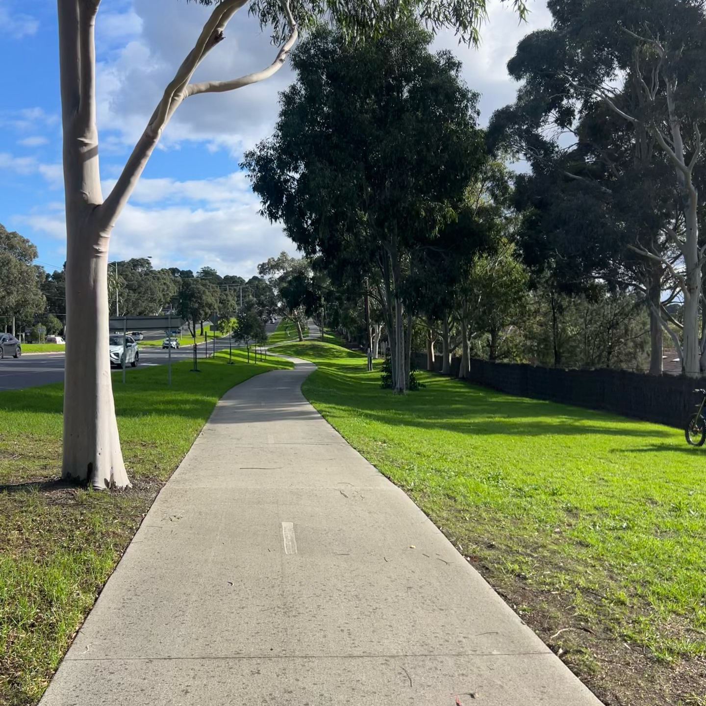

Another Saturday another long run, this time to Rowville and back. While I know the route like the back of my hand I have never ran it on foot before and as such never experienced the gradient first hand. It's not the most precipitous terrain in the world but the hill up to Jacksons Road from Eastlink will make you work for it. 

Stretching on the grass out in front of the Mulgrave McDonald's is not something I've ever thought of doing but it is nice to enjoy the more inconsistent moments.

As the kilometers stack up so does the time. I left at 9am and didn't arrive home until 3pm, while I wasn't running for the entire time that much time on your feet does take a toll.

At least it didn't rain.

