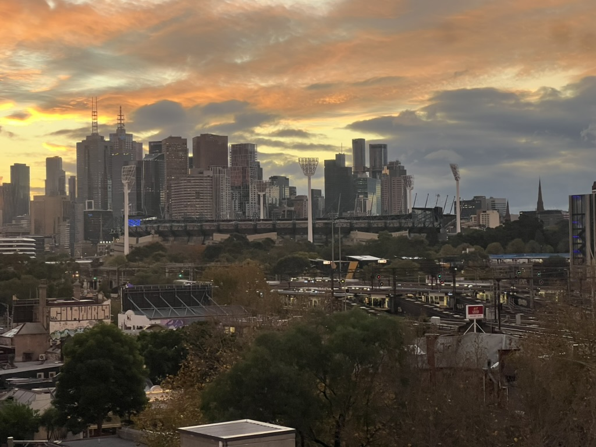

Standard Melbourne weather today with rain and wind being replaced with sunsets
by the end of the day. Our office in Cremorne has a beautiful view of the city
(at least when the weather permits) and the Botanical Gardens. I'll admit being
sceptical about working in the area but it's grown on me a lot.

The most annoying parts of working here is that I now have to take two trains
which due to timetabling has doubled the time it takes for me to get to work.
