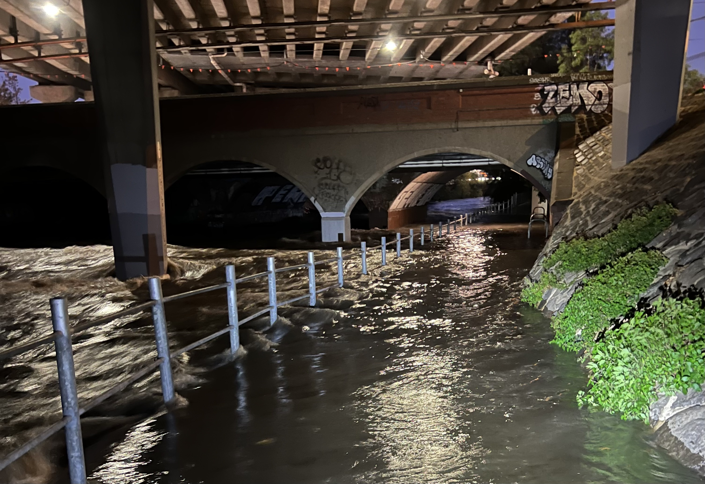

Just a bit wet today. Cycling in the rain is character building one once in a
while but I've got a feeling I'm going to have to get used to it. On average 14
days in June are rainy in Melbourne and it doesn't come in a downpour. The days
are going to be drizzly and cold.

The ride home took twice as long due to flooding and just as I made it to higher
elevation my bike chain jammed - there's nothing like trying to fix your bike in
rain, in the dark, alone.
