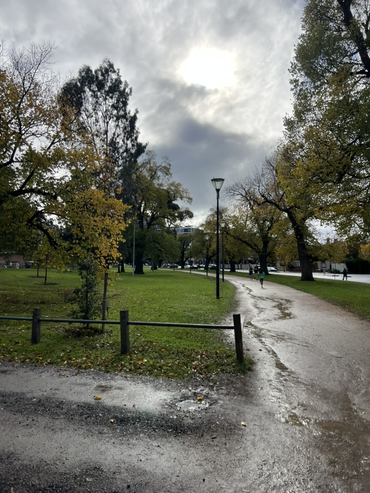

Most of today was taken up by running to Princes Park and back. It's interesting
how running long distances changes your perspective about travelling. At the
beginning of this year running to Albert Park from my place seemed like a
daunting distance where now it almost feels like warming up.

This was one of the more mentally difficult runs I've done in a while. Between
the pain in my right leg, the rain, and the busy streets it was really difficult
to keep a strong focus and mental fortitude.
