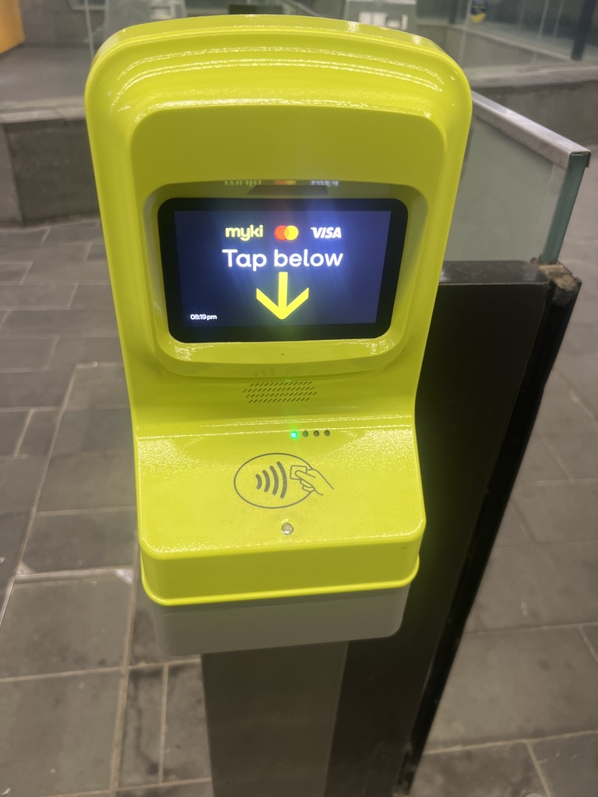

Very subtly over the long weekend, Metro launched tap and go payments for
[most of](https://www.abc.net.au/news/2026-06-06/tap-and-go-launching-on-victorian-public-transport/106764592)
the Melbourne train network. It's been a long time coming — Android users have
had mobile Myki since 2021, but
[PTV and Apple never reaching a commercial agreement](https://atadistance.net/2023/01/16/myki-mess/),
leaving iPhone users stuck with a physical card.

Melbourne is now the last major Australian city to get there, joining Sydney
(2018), Perth and Brisbane (2025), Adelaide (February 2026), and Canberra.

For many this will be the final reason they will no longer need to carry around
a physical wallet in Victoria as bank cards, public transport, and
identification are all available of a mobile.
