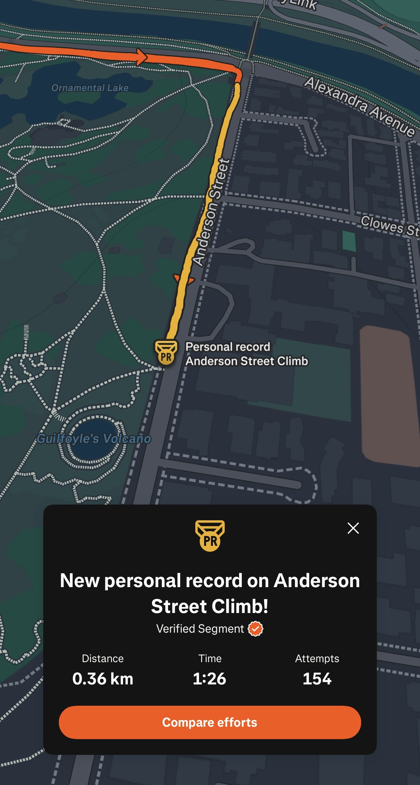

Something peculiar happened today, I broke my personal record my climbing
Anderson Street Hill - a fairly infamous segment around the Tan in Melbourne.
It's unexpected because during the climb I gassed out about three quarters of
the way up after doing 4 by 3 minute sessions on the flat.

It's a great sign to see when you're training because it means you're improving.
It's always good to break a PR but it's even more rewarding when it happens on a
day where you felt like you where nowhere near your potential.
